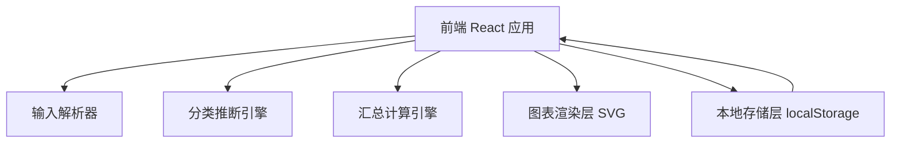
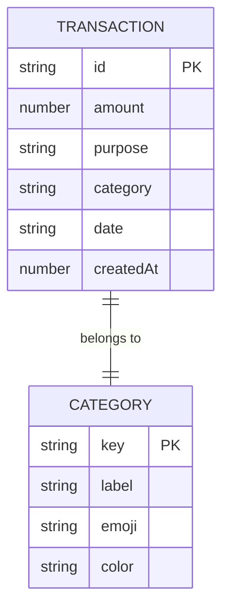

## 1. 架构设计

纯前端单页应用，无后端服务。所有交易数据持久化在浏览器 localStorage，解析、分类、汇总逻辑全部在前端完成。



## 2. 技术说明

- **前端框架**：React@18 + tailwindcss@3 + vite
- **初始化工具**：vite（react-ts 模板）
- **图表**：自绘 SVG（环形图、柱状图），避免重型图表库
- **字体**：Fraunces（显示）、DM Sans（正文）、JetBrains Mono（数字），通过 Google Fonts 引入
- **路由**：React Router v6（轻量，仅 2 个路由）
- **后端**：无
- **数据库**：无，使用 localStorage

## 3. 路由定义

| 路由 | 用途 |
|-------|---------|
| / | 记账主页：输入、今日概览、近期交易 |
| /summary | 汇总分析页：周月指标、分类占比、趋势图 |

## 4. 数据模型

### 4.1 数据模型定义



### 4.2 数据结构

**Transaction（交易记录）**
```ts
interface Transaction {
  id: string;          // 唯一标识，crypto.randomUUID()
  amount: number;      // 金额（元），保留两位小数
  purpose: string;     // 用途描述
  category: string;    // 分类 key
  date: string;        // 日期 YYYY-MM-DD
  createdAt: number;   // 创建时间戳
}
```

**Category（分类）**
```ts
interface Category {
  key: string;     // 如 'food'
  label: string;   // 如 '餐饮'
  emoji: string;   // '🍜'
  color: string;   // 主题色 hex
}
```

**localStorage 键**
- `ledger.transactions`：`Transaction[]`

### 4.3 输入解析规则

解析器从一句话中提取金额与用途：
1. 金额：匹配 `/\d+(\.\d{1,2})?/`，取第一个数字；若含"元/块"等量词辅助定位
2. 用途：去除金额与量词后的剩余文本，若为空则标记为"未分类支出"
3. 分类推断：用途文本与分类关键词字典做包含匹配，如"午餐/饭/面/外卖"→餐饮；"打车/地铁/公交/加油"→交通；无匹配则归入"其他"

### 4.4 默认分类字典

| key | label | emoji | color | 关键词 |
|-----|-------|-------|-------|--------|
| food | 餐饮 | 🍜 | #B5651D | 早中晚餐、饭、面、外卖、零食、奶茶、咖啡 |
| transport | 交通 | 🚇 | #6B8E6B | 打车、地铁、公交、加油、停车、高铁、机票 |
| shopping | 购物 | 🛍️ | #C77B58 | 买、购物、衣服、鞋、数码、日用品 |
| entertainment | 娱乐 | 🎬 | #8B6F9E | 电影、游戏、演出、会员、KTV |
| home | 居家 | 🏠 | #7A8B99 | 房租、水电、物业、宽带 |
| health | 健康 | 💊 | #A0522D | 药、医院、挂号、体检 |
| other | 其他 | 📌 | #9A9088 | （兜底） |
